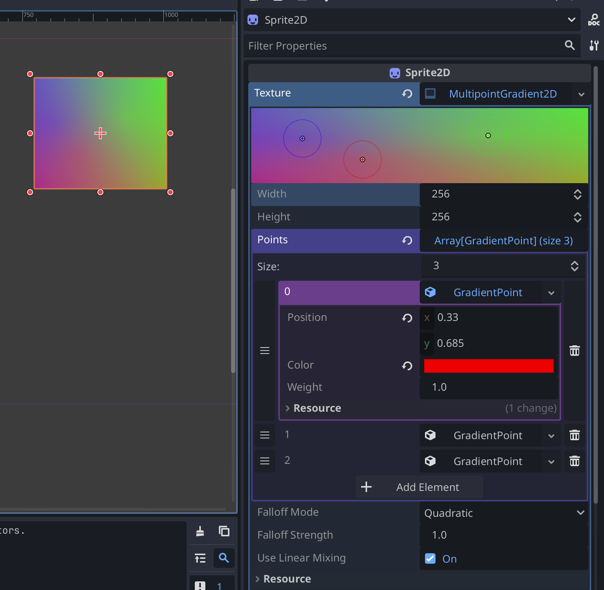

# Multipoint Gradient 2D

A procedural gradient texture generator that creates smooth gradients from multiple colored points.

## Usage

1. Enable the "Multipoint Gradient 2D" plugin in Project Settings - the in editor helper won't work without this.
2. Create a new `MultipointGradient2D` resource attached to a sprite
3. Profit

